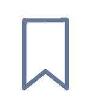

<h1 align="center"> MyTAB</h1>

A side project to gather some shortcuts, news, and useful links to make the day more updated and productive.

### 📰 APIs

-   Hackertab endpoints for:
    -   [Github](https://api.hackertab.dev/data/v2/github/global/daily.json)
    -   [Medium](https://api.hackertab.dev/data/v2/medium/javascript.json)
    -   [FreeCodeCamp](https://api.hackertab.dev/data/v2/freecodecamp/programming.json)
-   TabNews endpoint for:
    -   [Relevants](https://www.tabnews.com.br/api/v1/contents?strategy=relevant)

### 📦 Cool stuff

-   [Phosphor Icons](https://phosphoricons.com/), for the icon pack
-   [LottieFiles](https://lottiefiles.com/), for the flag animation
-   [Hypercolor](https://hypercolor.dev/), for the color palette
